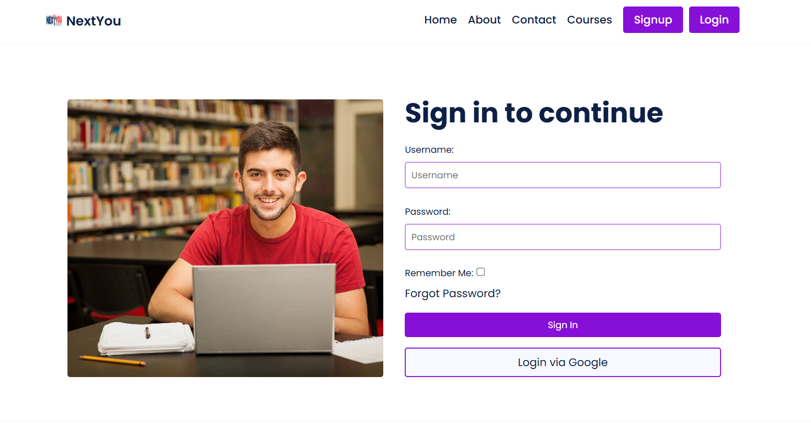
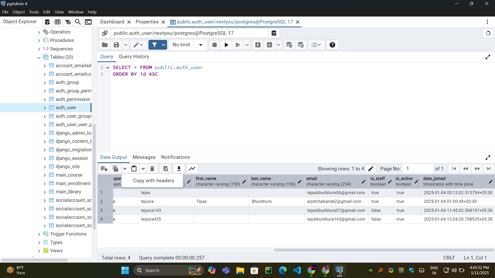

# NextYou LMS Platform

## Overview
NextYou is a modern Learning Management System (LMS) platform that enhances the online learning experience. It provides intuitive user interfaces for sign-up, sign-in, course management, and more. This README provides an overview of the project structure and setup instructions.



---

## File Structure

```
C:.
├───main
│   ├───migrations
│   │   └───__pycache__
│   └───__pycache__
├───nextyou
│   └───__pycache__
├───static
│   ├───css
│   ├───img
│   └───js
├───staticfiles
│   ├───admin
│   │   ├───css
│   │   │   └───vendor
│   │   │       └───select2
│   │   ├───fonts
│   │   ├───img
│   │   │   └───gis
│   │   └───js
│   │       ├───admin
│   │       └───vendor
│   │           ├───jquery
│   │           ├───select2
│   │           │   └───i18n
│   │           └───xregexp
│   ├───cloudinary
│   │   ├───html
│   │   └───js
│   ├───css
│   ├───img
│   └───js
└───templates
    ├───account
    │   ├───email
    │   ├───messages
    │   └───snippets
    ├───dashboard
    ├───openid
    ├───socialaccount
    │   ├───messages
    │   └───snippets
    └───tests
```

### Key Directories:
- **main**: Contains the core application files and migration scripts.
- **nextyou**: Core logic for the NextYou application.
- **static**: Holds static files such as CSS, JavaScript, and images.
- **staticfiles**: Collected static files (for production purposes).
- **templates**: HTML templates used for rendering web pages.
  - Includes subdirectories for accounts, dashboard, and social account integrations.

---

## Features
- User authentication (sign-up, sign-in, password reset).
- Dashboard for managing courses and user data.
- Integration with external libraries (e.g., Cloudinary).
- Responsive design with custom CSS and JS.

---

## Tools and Technologies

### Backend
- **Python**: Core programming language.
- **Django**: Web framework for building the LMS.
- **PostgreSQL**: Production-ready relational database.

### Frontend
- **HTML5**: Markup language for structuring pages.
- **CSS3**: Styling the application.
- **JavaScript**: Adding interactivity.
- **Bootstrap**: Responsive front-end framework.

### Additional Tools
- **Cloudinary**: For managing and serving media files.
- **Git**: Version control system.
- **Virtualenv**: Environment management for Python dependencies.

---

## Database
The project uses PostgreSQL to store user information, courses, and related data. Ensure the database configuration matches your environment. For structure details, refer to the database schema (see attached screenshots).



---

## Setup Instructions

### Prerequisites
- Python 3.8+
- Django 4.x
- PostgreSQL
- Node.js (for frontend assets if required)
- A virtual environment tool (e.g., `venv` or `virtualenv`)

### Steps

1. **Clone the Repository:**
   ```bash
   git clone https://github.com/your-repo/nextyou.git
   cd nextyou
   ```

2. **Create a Virtual Environment:**
   ```bash
   python -m venv venv
   source venv/bin/activate  # On Windows: venv\Scripts\activate
   ```

3. **Install Dependencies:**
   ```bash
   pip install -r requirements.txt
   ```

4. **Configure the Database:**
   Update `settings.py` with your PostgreSQL credentials:
   ```python
   DATABASES = {
       'default': {
           'ENGINE': 'django.db.backends.postgresql',
           'NAME': 'your_database_name',
           'USER': 'your_username',
           'PASSWORD': 'your_password',
           'HOST': 'localhost',
           'PORT': '5432',
       }
   }
   ```

5. **Apply Migrations:**
   ```bash
   python manage.py makemigrations
   python manage.py migrate
   ```

6. **Run the Server:**
   ```bash
   python manage.py runserver
   ```
   Access the application at `http://127.0.0.1:8000/`.

7. **Collect Static Files (For Production):**
   ```bash
   python manage.py collectstatic
   ```
